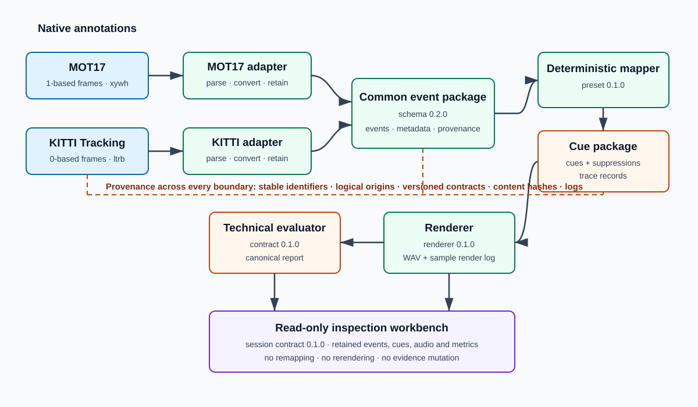
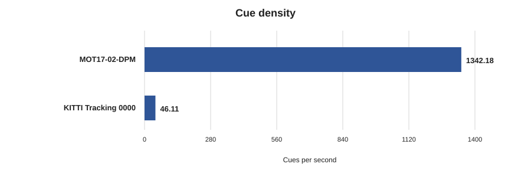
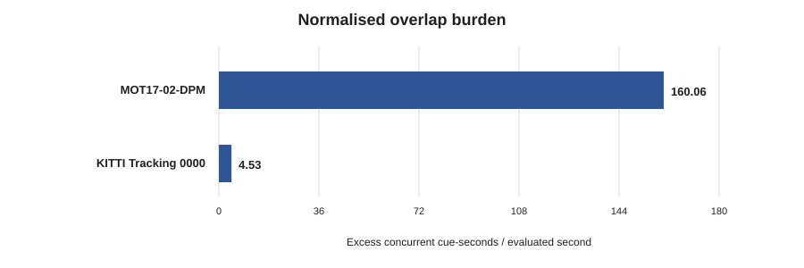

# Dissertation working manuscript

> This is the repository working manuscript for whole-document review, citation audit and
> evidence audit. It is not the final formatted assessment artefact. The authoritative submission
> remains the dissertation transferred to and formatted in Word/PDF after editorial compression,
> layout checking, proofreading and supervisor review.

**Working title:** *A Reproducible Workbench for Event-Based Sonification of Annotated Video Datasets*

---

---

# Abstract

Annotated video datasets contain frame-indexed spatial and temporal information that can support event-based sonification, but their native structures and ontologies differ. This project designed, implemented and technically evaluated a reproducible workbench that transforms heterogeneous tracking annotations into a common event schema, generates deterministic audio cues and explicit suppressions, preserves cue-level provenance and exposes retained outputs for inspection. MOT17-02-DPM and KITTI Tracking sequence 0000 were processed through dataset-specific adapters, schema version 0.2.0, one frozen mapping and renderer configuration, and Technical Evaluation Contract version 0.1.0.

The evaluation measured event accounting and coverage, temporal alignment, traceability, density, overlap and repeatability. MOT17 contained 30,003 valid events, producing 26,960 cues and 3,043 intentional suppressions; KITTI contained 1,089 valid events, producing 711 cues and 378 intentional suppressions. Both cases achieved 100% eligible-event coverage, complete cue and suppression traceability and zero maximum error at integer sample boundaries. Repeated packages, audio and reports were identical within the recorded Windows/AMD64/Python 3.14.3 environment. Output load differed substantially: MOT17 produced 1,342.18 cues per second and a normalised overlap burden of 160.06, compared with 46.11 and 4.53 for KITTI.

The contribution is an auditable annotation-to-sonification research workflow that separates native data interpretation, common events, mapping, rendering and evaluation through versioned contracts and provenance. The findings establish technical accountability and same-environment determinism for two selected cases. They do not establish perceptual effectiveness, usability, accessibility, navigation benefit or cross-platform byte identity because only one baseline mapping was evaluated and no participant study was undertaken.

---

# 1. Introduction

## 1.1 Problem and research gap

Annotated video datasets encode frame indices, track identities, classes and bounding-box geometry. These structured observations are plausible inputs to event-based sonification, the use of non-speech sound to represent data relationships (Hermann, Hunt and Neuhoff, 2011). However, MOTChallenge and KITTI were designed for different computer-vision tasks and use different indexing, geometry, ontology and metadata conventions (Dendorfer *et al.*, 2021; Geiger *et al.*, 2013). Their native annotations therefore require explicit interpretation before they can enter one reusable sonification workflow.

Parameter-mapping sonification also requires declared relationships between data and sound (Grond and Berger, 2011; Dubus and Bresin, 2013). For annotated video, a credible workflow must additionally account for observations that produce no cue, trace rendered samples to source rows and reproduce its decisions. Although reusable sonification and dataset-management tools address adjacent concerns, the reviewed literature does not provide an integrated workflow combining heterogeneous tracking annotations, a common sonification-ready event schema, deterministic cue generation, cue-level provenance and reproducibility-focused technical evaluation.

## 1.2 Aim, questions and objectives

The project aimed to design, implement and evaluate a reproducible workbench that converts annotated video data into normalised events, deterministic audio cues and traceable technical outputs. It addressed three questions:

1. **How can public annotated video datasets be transformed into a common event schema suitable for event-based sonification?**
2. **How can normalised visual events be mapped into deterministic and traceable audio cues?**
3. **How can event-based sonification outputs be evaluated using technical metrics for coverage, alignment, traceability and reproducibility?**

The objectives were to define a provenance-preserving event representation, implement MOT17 and KITTI Tracking adapters, generate deterministic cue/suppression and audio artefacts, and evaluate the chain technically. O1 and O2 were achieved. O3 and O4 were partially achieved because one baseline mapping and a rigorous subset of the proposed evaluation were completed, but planned comparative presets, density controls and some measures were not.

## 1.3 Scope and contribution

The study used MOT17-02-DPM and KITTI Tracking 0000, one frozen mapping and renderer, and no participants. It supports technical claims about accounting, alignment, traceability, load and same-environment reproducibility, not perceptual effectiveness, accessibility, navigation or safety.

The contribution is an auditable annotation-to-sonification workbench that separates dataset-specific ingestion from common events, makes cues and suppressions explicit, preserves provenance through rendering and evaluation, and exposes retained evidence through a read-only inspection layer. Chapters 2–5 develop the literature, method, implementation and results; Chapters 6–8 interpret the research questions, validity, ethics and contribution.

---

# 2. Literature Review

## 2.1 Sonification and reusable workflows

Sonification uses non-speech sound to communicate information within the wider field of auditory display (Hermann, Hunt and Neuhoff, 2011). Parameter-mapping sonification transforms data dimensions into acoustic or perceptual parameters through explicit functions (Grond and Berger, 2011). This makes time, image position and object geometry possible inputs to onset, stereo position, frequency or amplitude, but no mapping is self-validating.

Dubus and Bresin (2013) recorded 495 mappings across 179 publications, finding frequent use of pitch and links between spatial data and kinematic auditory dimensions. The diversity establishes parameter mapping as a recognised technique while undermining any assumption that common use makes a mapping optimal. Their finding that rigorous evaluation was relatively uncommon further separates implementable mappings from perceptual effectiveness. Consequently, the project exposes mapping functions and ranges as versioned configuration and treats its mapping as a technical reference policy.

Reusable systems establish complementary precedents. The Sonification Sandbox exposed configurable mappings from tabular data to pitch, volume, pan and timbre (Walker and Cothran, 2003); SIREN provides a browser-based modular workflow (Peng and Choi, 2021); and STRAUSS offers an open-source Python pipeline for scientific sonification (Trayford *et al.*, 2025). Collectively, they demonstrate the value of explicit, reusable data-to-sound workflows. They were not designed to interpret MOT17/KITTI rows or reconcile rendered sample intervals with source annotations and evaluation outcomes. The present contribution therefore concerns annotation normalisation and technical evidence rather than replacing general sonification tools.

These systems also show why configurability and reproducibility should not be conflated. A tool may expose many mapping choices yet still leave the exact input interpretation, generated schedule or evaluation denominator outside its principal abstraction. Conversely, fixing one mapping can support stronger reconstruction while saying little about perceptual quality. The completed artefact adopts the latter priority: one frozen reference mapping enables technical scrutiny, while comparative and human-centred questions remain open.

## 2.2 Visual-to-auditory evidence and claim boundaries

Participant research shows both the feasibility of visual-to-auditory representation and the need to test human outcomes empirically. Hu *et al.* (2020) compared real-time scene-sonification methods with visually impaired participants; Neugebauer *et al.* (2020) evaluated a navigation-aid pilot with blind participants; and Ji *et al.* (2021) investigated moving-object sonification with an event-based camera. Their tasks and devices differ, but perceptual or use claims are tied to participant methods rather than software correctness.

A deterministic cue may therefore be correctly derived and traced while remaining difficult to interpret. Density and overlap can describe acoustic load but cannot show whether listeners segregate streams. This literature supports visual-to-auditory research while requiring the current study to restrict conclusions to technical infrastructure.

The distinction also affects evaluation design. Participant outcomes depend on task, training, cue design and individual differences, whereas pipeline evaluation concerns whether declared transformations occurred. Combining these questions without an appropriate sample could make software metrics appear to stand in for accessibility evidence. The project instead treats traceability and temporal alignment as prerequisites that a later participant study could build upon, not substitutes for that study.

## 2.3 Tracking datasets and provenance

MOTChallenge benchmarks single-camera multiple-target tracking, while KITTI supports mobile-robotics and autonomous-driving research (Dendorfer *et al.*, 2021; Geiger *et al.*, 2013). Their purposes produce different conventions. MOT17 ground truth uses one-based frames, rectangular geometry and an evaluation mark; KITTI Tracking uses zero-based frames, left/top/right/bottom boxes, road-scene classes and truncation, occlusion and three-dimensional fields (MOTChallenge, no date; KITTI Vision Benchmark Suite, no date). The evaluation mark should not be relabelled as probability, nor should `DontCare` observations disappear when excluded from sound. Dataset-specific adapters are therefore necessary, although both cases share enough frame, class, identity and geometry structure to test a bounded common core.

Existing systems already manage annotations and formats: VIA supports image, audio and video annotation (Dutta and Zisserman, 2019); CVAT imports and exports multiple formats (CVAT.ai, no date); Datumaro converts and transforms datasets (Open Edge Platform, no date); and FiftyOne supports media/label inspection and evaluation (Voxel51, no date). The project does not claim novelty in general annotation management. Its concern is what survives the downstream annotation-to-sound transformation.

This comparison prevents an inflated contribution claim. General dataset systems solve broader curation, annotation and conversion problems, whereas the workbench assumes annotations already exist. Its adapters implement only the source semantics needed to create sonification-ready events, and its distinctive downstream concern is whether a cue or suppression remains accountable to a native row. That narrower boundary shaped both the common schema and the decision to preserve dataset-specific metadata rather than impose a universal ontology.

Datasheets and Data Cards emphasise documenting purpose, composition, provenance and transformations (Gebru *et al.*, 2021; Pushkarna, Zaldivar and Kjartansson, 2022). This informed source-aware events, configuration hashes, cue-to-event links and explicit suppressions. Provenance is therefore part of each package boundary rather than an account reconstructed after audio generation.

Explicit suppressions are especially important. If ineligible observations simply disappear, coverage can be increased by policy without revealing what was removed. Retaining the reason and source event makes inclusion policy inspectable and supports separate measures for eligible coverage and representation of all valid source events.

## 2.4 Reproducibility and synthesis

Reproducible computational research requires procedures, configurations and versions sufficient to reconstruct results (Sandve *et al.*, 2013). Pineau *et al.* (2021) similarly identify code, checklists and explicit reporting as practical reproducibility mechanisms. For this pipeline, those principles imply versioned contracts, path-independent deterministic identities, canonical serialisation, hashes, retained intermediates and metric definitions fixed before the reported cases. They also require precision: byte equality on one Windows/AMD64/Python environment is evidence of same-environment determinism, not cross-platform identity.

Reproducibility also has multiple levels. Semantically equivalent records may serialise differently; identical schedules do not alone prove identical audio; and an unchanged configuration name does not prove unchanged content. Separate semantic, byte, audio and configuration checks therefore provide a more defensible account than a single “reproducible” label. Freezing metric definitions before the real cases similarly reduces the opportunity to select favourable denominators or tolerances after observing results.

The combined literature establishes the research gap. Sonification supplies systematic mapping methods; reusable tools demonstrate explicit workflows; tracking datasets provide structured but heterogeneous events; provenance research requires transparent transformation; and participant studies show that human benefit cannot be inferred from technical correctness. Within the reviewed literature, no integrated workflow was identified that joins heterogeneous tracking annotations, a common sonification-ready event schema, deterministic cue generation, cue-level provenance and reproducibility-focused technical evaluation. This motivates the project’s bounded research-infrastructure design and its separation of technical findings from perceptual claims.

---

# 3. Methodology and Research Design

## 3.1 Research approach

The study used an iterative design-and-evaluation method to construct and examine a computational research artefact. The pipeline transforms annotations into normalised events, maps eligible events to cues, renders audio and exposes evidence for inspection. Reproducible-computing principles informed version recording, retained intermediates and avoidance of manual result manipulation (Sandve *et al.*, 2013; Pineau *et al.*, 2021). Each claim had to resolve to a contract, generated artefact, automated check or recorded decision.

Development proceeded through common-schema/adaptor construction, mapping/rendering, frozen technical evaluation and integration into a local read-only workbench. An **event** is one valid annotation observation at one frame; a **cue** is a scheduled audio representation; and a **suppression** is an explicit reason-coded decision that a valid event produces no cue. **Technical evaluation** concerns the computational transformation, not listener performance.

This order separated research questions that would otherwise be coupled. Schema/adaptor validation established the input meaning before audio was produced; mapping and rendering were then evaluated against that stable representation; and the inspection interface was built over retained evidence rather than becoming a second processing implementation. Decisions, risks and verification records distinguished implemented behaviour from proposal intent throughout development.

## 3.2 Case selection and construction

MOT17-02-DPM and KITTI Tracking 0000 were purposively selected to exercise different conventions rather than support population inference (Dendorfer *et al.*, 2021; Geiger *et al.*, 2013). Table 1 summarises the relevant boundary.

MOT17 provides a dense pedestrian-focused case at 30 frames per second, whereas KITTI supplies a lower-rate road-scene case with broader classes and richer metadata. Their contrast tests whether shared downstream processing can coexist with source-specific parsing, but it does not make the sequences statistically comparable or representative of their complete datasets.

**Table 1. Native case differences and adapter treatment. Author summary of dataset documentation and implemented contracts.**

| Concern | MOT17-02-DPM | KITTI 0000 | Common treatment |
|---|---|---|---|
| Frame/time | One-based; 30 fps | Zero-based; 10 fps | Zero-based frame and derived timestamp |
| Geometry | `x`, `y`, width, height | left, top, right, bottom | Pixel `x`, `y`, width, height |
| Semantics | Tracking classes/evaluation mark | Road classes, `DontCare`, 3D fields | Common/source labels separated; native metadata retained |
| Confidence | Evaluation mark is not probability | Optional score | Confidence populated only where source meaning supports it |
| Provenance | Source row/configuration | Source row/configuration | Deterministic identity, logical origin and hashes |

Each adapter applies explicit index/geometry conversions and emits schema `0.2.0` event packages. The mapper consumes validated events under preset `0.1.0`, producing a cue or suppression account. Renderer `0.1.0` emits PCM audio and sample-level logs. Stable identifiers and hashes connect stages. Session Contract `0.1.0` binds retained event, cue, audio and evaluation artefacts for inspection without reimplementing processing.

Full datasets, generated packages and WAV files remained outside version control. Logical inputs, expected hashes and environment-variable roots connect independently obtained local data to results without embedding private machine paths.

## 3.3 Evaluation design

Technical Evaluation Contract `0.1.0` was frozen before the real cases. It defines event outcomes and coverage denominators, sample/seconds timing domains, resolved traceability, density/overlap and levels of reproducibility. Freezing definitions reduced scope for post-hoc favourable metrics.

A manually calculated synthetic oracle first exercised five events, five cues, one suppression, overlapping/touching intervals and sample conversion. Negative cases introduced eligible misses, orphan cues, contradictory outcomes, broken links and a one-sample displacement, mitigating the risk that pipeline and evaluator shared the same error. The unchanged contract was then applied to both public-data chains. Repeated builds tested determinism; an independent audit compared canonical reports with tables, figures, captions and hashes.

Accounting completeness requires one recognised outcome per valid event. Eligible coverage excludes intentional suppressions, while source representation includes them. Alignment compares expected and actual boundaries; traceability resolves identifiers and hashes; density/overlap describe load; and reproducibility distinguishes semantic, byte, audio and configuration identity.

These distinctions were methodological controls rather than reporting conveniences. They prevent intentional policy exclusions being labelled misses, floating-point seconds obscuring exact sample placement, plausible identifiers being accepted without resolving their links, and same-environment equality being generalised to untested platforms.

## 3.4 Research quality and scope

Versioned contracts, deterministic identities, automated tests, byte comparisons, the independent oracle, injected faults and the reporting audit support reliability and internal validity. Construct validity is bounded: the metrics measure transformation properties, not intelligibility. External validity is limited by two selected sequences, rectangular annotations, one mapping/renderer and one recorded execution environment. Shared conventions may still influence pipeline and evaluator despite independent checks. Conclusions are therefore descriptive technical claims. No participant, accessibility or task-performance experiment was conducted, and cross-platform byte identity was not tested.

---

# 4. Workbench Design and Implementation

## 4.1 Architecture and normalisation

The workbench uses independently verifiable packages rather than one opaque conversion. Figure 1 shows dataset-specific adapters converging on a common event contract, followed by shared mapping, rendering and evaluation. The inspection layer consumes retained products without remapping or rerendering them.

Schema `0.2.0` defines one event as one valid annotation observation and groups stable identity, zero-based time, object labels, pixel geometry, provenance and source metadata. The MOT17 adapter converts one-based frames and retains its ground-truth evaluation mark as metadata rather than confidence. The KITTI adapter converts corner coordinates and preserves truncation, occlusion, alpha and three-dimensional fields; `DontCare` remains a valid event. Downstream components receive one interface without implying identical native ontologies. Out-of-image boxes are retained with warnings rather than silently clipped.

**Table 2. Common event-schema groups and their reproducibility purpose. Author summary of schema `0.2.0`.**

| Group | Principal fields | Purpose |
|---|---|---|
| Identity and time | event/track identifiers, frame index, timestamp | Stable reference and temporal ordering |
| Semantics | common class, source class, source attributes | Shared processing without erasing native meaning |
| Geometry | image dimensions and bounding-box coordinates | Normalised mapping inputs with retained pixel context |
| Provenance | dataset, sequence, source row and hashes | Resolution from a derived event to its declared source |

Validation is deliberately stricter than adapter convenience. It rejects malformed identifiers, non-finite values, invalid box ordering and inconsistent dimensions, while emitting warnings for geometries that may be legitimate annotations but exceed the image boundary. This distinction keeps structural failures out of the pipeline without silently rewriting source observations. Package manifests record counts, schema/configuration versions, source identities and file hashes, so later stages can verify that they consumed the declared event set rather than a similarly named local file.

## 4.2 Mapping and rendering

Baseline preset `0.1.0` implements a simple auditable parameter mapping. Table 3 summarises the rules and their interpretation boundaries.

**Table 3. Frozen mapping and renderer rules. Author summary of preset and renderer `0.1.0`; exact hashes are retained in session declarations.**

| Rule | Implemented treatment |
|---|---|
| Time and duration | Event timestamp sets cue start; duration is 0.12 s |
| Space and frequency | Horizontal centre sets pan; inverted vertical centre sets 220–1,760 Hz |
| Amplitude | Normalised bounding-box area sets 0.1–0.8; area is not metric depth |
| Eligibility | Each valid event becomes a cue or reason-coded suppression under class/confidence/stride policy |
| Rendering | 44.1 kHz stereo 16-bit PCM; round-half-up, half-open intervals and stable mixing order |
| Class modifier | Retained for traceability but inaudible in renderer `0.1.0` |

Inputs are clamped and mapped values rounded to six decimals. The canonical preset uses every frame and does not treat null confidence as low confidence. Content-derived cue identifiers exclude time-varying state, random values and local paths, so cues and suppressions can be reconstructed from declared inputs.

Suppression is represented as an outcome rather than deletion. Every valid input therefore has exactly one terminal mapping status, allowing the evaluator to distinguish an intentional class-policy decision from an unexplained absence. Keeping the inaudible class modifier in the cue package similarly exposes an implementation boundary: the value is reproducible and inspectable, but no audible class distinction should be claimed for renderer `0.1.0`.

The renderer converts time boundaries to samples, synthesises fixed-envelope sine cues, applies stereo balance and mixes in stable order with conditional peak normalisation. Its log records the event, cue, parameters and sample interval for every placement. This is a reproducible reference renderer, not a perceptually optimised design. It contains no priority, refractory or polyphony control, and bounding-box area is only an imperfect apparent-scale proxy (Dubus and Bresin, 2013).

## 4.3 Inspection layer and outcome

Workbench Session Contract `0.1.0` declares the event, cue, audio and evaluation packages and derives a path-independent session identity. Runtime roots bind local evidence; validation checks the chain before the loopback-only server displays imagery/boxes, unchanged WAV playback, timeline outcomes, provenance and Stage 3 metrics.

The MOT17 and KITTI sessions passed 16 researcher-controlled browser checks for loading, synchronisation, selection, trace inspection and metric display. These were engineering acceptance checks, not usability testing. A workbench screenshot remains excluded because no publication-cleared source frame was retained.

O1/O2 were achieved. O3/O4 were partially achieved: deterministic generation/export and a rigorous technical evaluation were completed, but comparative presets, density controls, ablations and some proposed measures were not.

---

# 5. Technical Evaluation and Results

## 5.1 Evaluation design

The frozen Technical Evaluation Contract `0.1.0` separated event accounting, timing, traceability, output load and same-environment reproduction. Before the real cases, a manual oracle verified known cue/suppression outcomes and sample calculations; negative tests introduced misses, orphan cues, contradictory outcomes, broken links and one-sample displacement. The unchanged contract was then applied to MOT17-02-DPM and KITTI Tracking 0000. An independent audit checked 134 source/derived values, 136 table cells, 20 figure points, 12 claims, seven captions and 23 hashes with no mismatches. Canonical report identities are listed in the [Phase A evidence baseline](evidence-baseline.md).

The evaluation unit was a valid normalised event, not a unique object track or source frame. Consequently, repeated observations of one tracked object were counted separately, matching the implemented event-to-cue policy. Metrics were computed from retained packages rather than the browser view, and the publication tables and figures were regenerated from frozen reports. This separation limited presentation code from becoming an alternative source of results.

## 5.2 Accounting and coverage

MOT17 contained 30,003 valid events: 26,960 were represented by cues and 3,043 intentionally suppressed under the class policy. KITTI contained 1,089 valid events: 711 represented and 378 `DontCare` observations suppressed. Neither case had a missed, invalidly excluded or unaccounted event, giving 100% accounting completeness and 100% eligible-event coverage.

Source representation, whose denominator includes suppressions, was 89.86% for MOT17 and 65.29% for KITTI. KITTI’s lower value therefore reflects policy rather than mapping failure. Table 4 and Figure 2 contain the audited outcomes.

[**Table 4. Audited event accounting and coverage. Presentation derivative of the canonical reports under contract `0.1.0`.**](../evaluation/reporting/tables/table-1-event-accounting-and-coverage.md)

The equality between valid events and represented-plus-suppressed outcomes is the accounting claim. Eligible-event coverage uses only events allowed by the frozen policy as its denominator. Reporting both measures avoids the superficially contradictory conclusion that KITTI simultaneously had complete eligible coverage and a lower proportion of all source observations rendered as sound.

## 5.3 Alignment and traceability

All scheduled and rendered boundaries matched expected integer sample indices: maximum error was zero samples in scheduling, placement and end-to-end domains. KITTI also had zero seconds-domain error. MOT17 maxima were approximately 3.33 × 10^-7 seconds for scheduling/placement and 1.67 × 10^-15 seconds end to end, floating-point observations that do not contradict exact sample placement.

Every represented event resolved from source annotation through cue to rendered interval: 26,960/26,960 MOT17 cues and 711/711 KITTI cues. All 3,043 and 378 suppressions were traceable, with no broken links.

## 5.4 Density and overlap

MOT17 generated 26,960 cues over 20.0867 seconds (1,342.18 cues/s), compared with 711 over 15.42 seconds for KITTI (46.11 cues/s). Maximum cue starts in a half-open one-second window were 1,500 and 116; peak concurrency was 203 and 24. Both timelines overlapped throughout. Normalised overlap burden was 160.06 for MOT17 and 4.53 for KITTI. These values describe technical load, not listener performance.

[**Table 5. Audited timing, traceability and reproducibility. Sample/seconds and environment boundaries preserved.**](../evaluation/reporting/tables/table-2-timing-traceability-reproducibility.md)

[**Table 6. Audited density and overlap metrics. Frozen preset/renderer and half-open intervals.**](../evaluation/reporting/tables/table-3-density-and-overlap.md)

## 5.5 Reproducibility

For each dataset, two Stage 2 runs reproduced all four event-package, five cue-package and three audio-package files byte-for-byte. Three evaluator runs produced semantically and byte-identical reports, and fresh reporting builds reproduced all 24 reporting artefacts. This establishes deterministic reproduction in the recorded Windows/AMD64/Python 3.14.3 environment, not cross-platform byte identity.

These repetitions test the frozen implementation and retained inputs; they do not estimate variability across operating systems, audio libraries or future dependency versions. The environment qualifier is therefore part of the result rather than a reporting footnote.

---

# 6. Discussion

## 6.1 RQ1: How can public annotated video datasets be transformed into a common event schema suitable for event-based sonification?

The cases show that heterogeneous tracking annotations can be transformed by separating a stable common core from source-specific interpretation. Frame indices, timestamps and box geometry are normalised; common/source labels remain separate; and provenance retains dataset, sequence, source row, configuration and hashes. This respects the datasets’ different purposes rather than treating their rows as interchangeable (Dendorfer *et al.*, 2021; Geiger *et al.*, 2013). Thus the MOT17 evaluation mark remains metadata, while KITTI’s `DontCare` and three-dimensional fields remain auditable.

This extends dataset-documentation principles from dataset-level origin and transformation (Gebru *et al.*, 2021; Pushkarna, Zaldivar and Kjartansson, 2022) into individual events and packages. **RQ1 is answered:** for the selected formats, dataset-specific adapters can produce a versioned common event schema while retaining native semantics and provenance. The result covers two frame-level rectangular formats, not universal interoperability.

## 6.2 RQ2: How can normalised visual events be mapped into deterministic and traceable audio cues?

Determinism followed from fixing eligibility, equations, ranges, rounding, identities and renderer policy, not merely from using simple functions. Each event has a cue or coded suppression; content-derived identifiers and hashes bind inputs/configuration; and stable sample conversion/mixing connects cues to rendered intervals. This treats mapping as an explicit design object, consistent with parameter-mapping research (Grond and Berger, 2011).

However, determinism is not perceptual effectiveness. Mapping practice is diverse and often weakly evaluated (Dubus and Bresin, 2013). In particular, bounding-box area is an imperfect apparent-scale input affected by pose, truncation, occlusion and perspective, not metric depth (R21). **RQ2 is answered:** versioned mapping and rendering contracts can create deterministic, traceable cues and suppressions for one baseline, without establishing listener comprehensibility or superiority.

## 6.3 RQ3: How can event-based sonification outputs be evaluated using technical metrics for coverage, alignment, traceability and reproducibility?

Predeclared outcomes and denominators prevented cue count from being mistaken for event coverage and suppressions from being treated as misses. Multi-domain timing preserved the distinction between exact sample placement and small seconds-domain floating-point differences. Trace tests resolved identifiers/hashes, while tiered reproduction separated semantic, byte, audio and configuration claims. This operationalises reproducibility as testable procedure rather than aspiration (Sandve *et al.*, 2013; Pineau *et al.*, 2021).

The load results also show why correctness metrics are insufficient: the accounting results in Table 4 coexist with substantially different density and overlap profiles. Participant studies demonstrate why those technical loads cannot predict human performance (Hu *et al.*, 2020; Neugebauer *et al.*, 2020; Ji *et al.*, 2021). **RQ3 is answered:** a frozen outcome model, coverage denominators, sample/seconds alignment, resolved traces, load measures and tiered repeatability provide an auditable technical evaluation when supported by an oracle, fault tests and independent reporting audit.

## 6.4 Contribution and threats to validity

The common pipeline handled different rates, dimensions, formats and classes without dataset-specific rendering. KITTI’s lower source representation reflects retained/suppressed `DontCare`; MOT17’s dense output reflects many eligible observations. The contribution complements reusable sonification systems (Walker and Cothran, 2003; Peng and Choi, 2021; Trayford *et al.*, 2025) by joining tracking annotations to common events, provenance and predeclared evaluation; no comparative superiority was tested.

The cases are contrasting probes, not a benchmark comparison: native annotations, durations, policies and scenes differ, so dataset identity alone cannot explain the density gap. MOT17 stresses dense eligible observations; KITTI tests richer metadata and an explicit non-sonified class. Complete accounting in both supports the architecture claim, while their load profiles expose where later policies require evaluation.

**Construct validity.** Accounting, alignment, traceability and reproduction measure pipeline properties, not intelligibility. Density/overlap measure load, and source representation depends on class policy.

**Internal validity.** Pipeline and evaluator share conventions, so a common error could inflate agreement. The independent oracle, injected faults, negative tests, frozen contract and reporting audit mitigate but cannot eliminate this risk. One mapping prevents attribution of load to individual design choices.

**External validity.** One sequence from each of two tracking datasets, one renderer and no participant population limit generalisation. Other modalities may require schema extensions.

**Conclusion validity.** Complete coverage does not imply good sound design; zero sample error does not imply perceptual simultaneity. Informal researcher difficulty with dense overlaps (R20) is not participant evidence, and no comparative condition supports improvement claims.

**Reproducibility validity.** Repeated packages, audio and reports support determinism only in the recorded environment. CI on Ubuntu tests non-private code but not the retained data/audio chain; cross-platform byte identity remains untested.

Finally, each observation is mapped independently. Track aggregation, priority, refractory periods or polyphony limits may reduce density, but require new technical comparisons and participant work for human-centred conclusions.

---

# 7. Ethical Considerations and Critical Reflection

## 7.1 Ethical and professional decisions

No participants were recruited, but this did not remove ethical responsibility. Participant studies connect perceptual, accessibility and navigation claims to human evidence (Hu *et al.*, 2020; Neugebauer *et al.*, 2020; Ji *et al.*, 2021). The project therefore adopted a non-assistive boundary: it reports technical correctness, traceability and repeatability without inferring usability, accessibility or safety. This boundary shaped the evaluation contract, risk register and reporting language.

Public availability was not treated as permission for unrestricted redistribution. Full MOT17/KITTI data, generated packages and WAV files remained local; small committed fixtures carry attribution/licence records. Logical paths, hashes and environment-variable roots enable authorised reproduction without publishing machine-specific locations. The loopback-only inspection layer is read-only, and the optional screenshot remains excluded because depicted people are not anonymised and reproduction/privacy clearance is unresolved.

Evidence integrity was supported by versioned contracts, canonical serialisation, hashes, explicit suppressions and frozen Stage 3 reports. These mechanisms do not make a mapping ethically or perceptually valid; they make its decisions inspectable and reduce undocumented post-hoc manipulation.

The same restraint applies to representation. Object labels inherit assumptions and limitations from the source datasets, while sonifying each annotation can amplify their presence without conveying uncertainty or social context. The common schema preserves source labels and metadata rather than presenting harmonised categories as neutral ground truth. Because no participant evidence established benefit, the artefact is framed as a research inspection tool and not deployed for navigation, monitoring or consequential decision-making.

## 7.2 Critical reflection

Two integration failures illustrate the value of explicit acceptance gates. First, retained-path validation assumed one output root although real packages occupied separate stage roots; detection during retained-chain testing led to corrected binding before acceptance. Second, browser checks found unstable dense-timeline presentation and frame controls that exposed only the first ten cues. Caching/stable ordering and complete frame-scoped controls corrected the defects. The lesson was that package tests alone did not prove that a researcher could follow one event consistently across the inspection surface. The final 16 checks therefore support engineering acceptance, not usability.

Scope control was equally consequential. O1 and O2 were achieved, whereas O3 and O4 were partially achieved. One deterministic baseline and rigorous technical evaluation were completed; comparative presets, density controls, scheduler ablations and some proposed measures were not. Freezing one mapping enabled stronger evidence about transformation, provenance and reproduction without introducing an unsupported comparison of perceptual quality. Reporting partial achievement is more defensible than redefining the original objectives.

R20 and R21 reinforce that restraint. Informal researcher inspection suggested that dense overlaps may be difficult to distinguish, but cannot show that listeners find them unusable. Bounding-box area is an amplitude input and limited apparent-scale proxy, not depth; pose, occlusion, truncation and perspective can change it without physical approach. Track aggregation, controlled listening studies, height/smoothing or KITTI three-dimensional fields remain future work, not completed evidence.

The principal professional lesson is that preserving the frozen baseline while correcting its inspection layer and retaining limitations produced a narrower but more credible contribution.

Reproducibility also required practical judgement about disclosure. Publishing raw paths, private media or derived audio would have simplified demonstration but weakened licence, privacy and portability controls. Separating public code/fixtures from retained local evidence made the submission less self-contained, yet produced a more defensible evidence boundary. The session contract and audit records compensate by specifying exactly what authorised researchers must resolve and verify.

---

# 8. Conclusion and Future Work

This project produced an auditable workbench that separates dataset interpretation, common events, deterministic cue/suppression generation, rendering and technical evaluation.

For RQ1, dataset-specific adapters transformed MOT17-02-DPM and KITTI Tracking 0000 into schema `0.2.0` while preserving native labels, metadata and provenance. This does not establish universal interoperability. For RQ2, fixed eligibility, mapping, identity, rounding and renderer contracts produced deterministic, fully traceable cues and suppressions for one baseline, not an optimal or perceptually validated mapping. For RQ3, predeclared outcomes/denominators, sample/seconds alignment, resolved provenance, load metrics and tiered repetition provided an auditable technical evaluation.

Both cases achieved complete accounting, 100% eligible coverage, complete cue/suppression traceability and zero maximum integer-sample error; repeated outputs matched in the recorded environment. O1/O2 were achieved and O3/O4 partially achieved because comparative presets, density controls, ablations and some proposed measures were not completed. The main limitation is that technical correctness coexisted with extreme MOT17 density, without participant evidence about distinguishability.

The dissertation's contribution is therefore methodological as much as technical: it demonstrates how an event-sonification claim can be bounded by explicit source interpretation, terminal outcomes, reproducible artefacts and metrics whose denominators remain visible. That evidence chain supports scrutiny of what the software did while preventing correctness results from being promoted into untested human-centred claims.

Future work should compare track aggregation, priority, refractory and polyphony controls against the frozen baseline; test height, smoothing and KITTI three-dimensional data as alternatives to area; and evaluate discrimination, workload and accessibility with appropriate participants/ethics approval. Additional formats and cross-platform reproduction should then test the boundaries of the common schema and deterministic implementation.

---

# References

CVAT.ai (no date) *Dataset management* [online]. Available from: https://docs.cvat.ai/docs/dataset_management/ [Accessed 19 August 2026].

Dendorfer, P., Ošep, A., Milan, A., Schindler, K., Cremers, D., Reid, I., Roth, S. and Leal-Taixé, L. (2021) MOTChallenge: A benchmark for single-camera multiple target tracking. *International Journal of Computer Vision* [online]. 129, pp.845–881. Available from: https://doi.org/10.1007/s11263-020-01393-0 [Accessed 19 August 2026].

Dubus, G. and Bresin, R. (2013) A systematic review of mapping strategies for the sonification of physical quantities. *PLOS ONE* [online]. 8 (12): e82491. Available from: https://doi.org/10.1371/journal.pone.0082491 [Accessed 19 August 2026].

Dutta, A. and Zisserman, A. (2019) The VIA annotation software for images, audio and video. In: *Proceedings of the 27th ACM International Conference on Multimedia*. New York: ACM, pp.2276–2279. Available from: https://doi.org/10.1145/3343031.3350535 [Accessed 19 August 2026].

Gebru, T., Morgenstern, J., Vecchione, B., Vaughan, J.W., Wallach, H., Daumé III, H. and Crawford, K. (2021) Datasheets for datasets. *Communications of the ACM* [online]. 64 (12), pp.86–92. Available from: https://doi.org/10.1145/3458723 [Accessed 19 August 2026].

Geiger, A., Lenz, P., Stiller, C. and Urtasun, R. (2013) Vision meets robotics: The KITTI dataset. *The International Journal of Robotics Research* [online]. 32 (11), pp.1231–1237. Available from: https://doi.org/10.1177/0278364913491297 [Accessed 19 August 2026].

Grond, F. and Berger, J. (2011) Parameter mapping sonification. In: Hermann, T., Hunt, A. and Neuhoff, J.G., eds. *The Sonification Handbook*. Berlin: Logos Publishing House, pp.363–397. Available from: https://sonification.de/handbook/chapters/chapter15/ [Accessed 19 August 2026].

Hermann, T., Hunt, A. and Neuhoff, J.G., eds. (2011) *The Sonification Handbook*. Berlin: Logos Publishing House. Available from: https://sonification.de/handbook/ [Accessed 19 August 2026].

Hu, W., Wang, K., Yang, K., Cheng, R., Ye, Y., Sun, L. and Xu, Z. (2020) A comparative study in real-time scene sonification for visually impaired people. *Sensors* [online]. 20 (11): 3222. Available from: https://doi.org/10.3390/s20113222 [Accessed 19 August 2026].

Ji, Z., Hu, W., Wang, Z., Yang, K. and Wang, K. (2021) Seeing through events: Real-time moving object sonification for visually impaired people using event-based camera. *Sensors* [online]. 21 (10): 3558. Available from: https://doi.org/10.3390/s21103558 [Accessed 19 August 2026].

KITTI Vision Benchmark Suite (no date) *Object tracking evaluation* [online]. Available from: https://www.cvlibs.net/datasets/kitti/eval_tracking.php [Accessed 19 August 2026].

MOTChallenge (no date) *MOT17 data* [online]. Available from: https://motchallenge.net/data/MOT17/ [Accessed 19 August 2026].

Neugebauer, A., Rifai, K., Getzlaff, M. and Wahl, S. (2020) Navigation aid for blind persons by visual-to-auditory sensory substitution: A pilot study. *PLOS ONE* [online]. 15 (8): e0237344. Available from: https://doi.org/10.1371/journal.pone.0237344 [Accessed 19 August 2026].

Open Edge Platform (no date) *How to use Datumaro* [online]. Available from: https://open-edge-platform.github.io/datumaro/latest/docs/user-manual/how_to_use_datumaro.html [Accessed 19 August 2026].

Peng, H. and Choi, I. (2021) SIREN: A case study in web audio based sonification. In: *Proceedings of the 26th International Conference on Auditory Display*. Virtual conference: ICAD. Available from: http://hdl.handle.net/1853/66345 [Accessed 19 August 2026].

Pineau, J., Vincent-Lamarre, P., Sinha, K., Larivière, V., Beygelzimer, A., d’Alché-Buc, F., Fox, E. and Larochelle, H. (2021) Improving reproducibility in machine learning research: A report from the NeurIPS 2019 Reproducibility Program. *Journal of Machine Learning Research* [online]. 22 (164), pp.1–20. Available from: https://www.jmlr.org/papers/v22/20-303.html [Accessed 19 August 2026].

Pushkarna, M., Zaldivar, A. and Kjartansson, O. (2022) Data Cards: Purposeful and transparent dataset documentation for responsible AI. In: *Proceedings of the 2022 ACM Conference on Fairness, Accountability, and Transparency*. New York: ACM, pp.1776–1826. Available from: https://doi.org/10.1145/3531146.3533231 [Accessed 19 August 2026].

Sandve, G.K., Nekrutenko, A., Taylor, J. and Hovig, E. (2013) Ten simple rules for reproducible computational research. *PLOS Computational Biology* [online]. 9 (10): e1003285. Available from: https://doi.org/10.1371/journal.pcbi.1003285 [Accessed 19 August 2026].

Trayford, J.W., Youles, S., Harrison, C., Shepherd, R. and Bonne, N. (2025) strauss: Sonification Tools and Resources for Analysis Using Sound Synthesis. *Journal of Open Source Software* [online]. 10 (109): 7875. Available from: https://doi.org/10.21105/joss.07875 [Accessed 19 August 2026].

Voxel51 (no date) *FiftyOne basics* [online]. Available from: https://docs.voxel51.com/user_guide/basics.html [Accessed 19 August 2026].

Walker, B.N. and Cothran, J.T. (2003) Sonification Sandbox: A graphical toolkit for auditory graphs. In: *Proceedings of the 9th International Conference on Auditory Display*. Boston, MA: ICAD, pp.161–163. Available from: http://hdl.handle.net/1853/50490 [Accessed 19 August 2026].
